# narcos-oven

NARCOS.sugar 肉桂捲店的 **出爐指揮台** — 拖檔進來就直接看到今天要烤幾顆、貼哪張標籤、賺多少錢。

線上版：<https://narcos-oven.vercel.app>

---

## 這個專案在解什麼問題

老闆本來每週要做這件事：

1. 早上去 **賣貨便後台** 匯出訂單 Excel
2. 打開 **面交 Google Form** 抄新的回覆
3. 去 Google Sheet 把 **KOL 合作單** 對一次
4. 手動對帳、算量、算今天要烤幾盤肉桂捲
5. 貼標籤、印出貨單、算分潤
6. 隔週還要再對一次「上次哪些訂單消失了？誰改了地址？」

三個來源、兩個 Excel 版式、一週兩批出爐、標籤還要對到門市代碼——**任何一步錯就有客人拿不到肉桂捲**。

narcos-oven 把這整條線收攏成一個桌面應用：**拖檔進來 → 全部收齊 → 排程算好 → 標籤能印 → 分潤算完**。所有算術都是 deterministic 程式碼（不是 LLM 猜），錯了會 loud 報錯而不是靜默錯過。

一句話：**把「烤」跟「賣」之間那條斷裂的手工橋，換成一台不會靜默失效的自動化工作台。**

---

## 主要功能（含截圖）

App 左上到右分成六個主分頁：**儀表板 · 排程 · 待處理 · 訂單總覽 · 手打單 · 菜單**。以下按實際工作流順序介紹。

### 1. 儀表板 — 一眼看到本週生意的形狀

進來就先看到「本批要出幾顆」「本月營收」「有沒有訂單卡住待處理」。四個分頁：**總覽 / 分潤統計 / 出爐統計 / KOL ROI / 駐店對帳**。

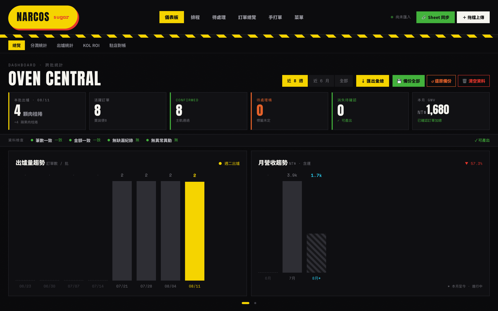

- **出爐量趨勢**：最近八週每批出貨數，讓老闆知道生意在爬還是掉
- **月營收趨勢**：本月至今 vs 前幾個月，右上會標「▼ 57.3%」告訴你本月速度
- **資料檢查一條列**：筆數 / 金額 / 缺漏 / 異常，四個燈全綠才可以出爐

**分潤統計**：拆掉「營收看起來漂亮但實際淨賺多少」的問題。含駐店運費（老闆自付）、平台手續費、成本、KOL 分潤全部算進去：

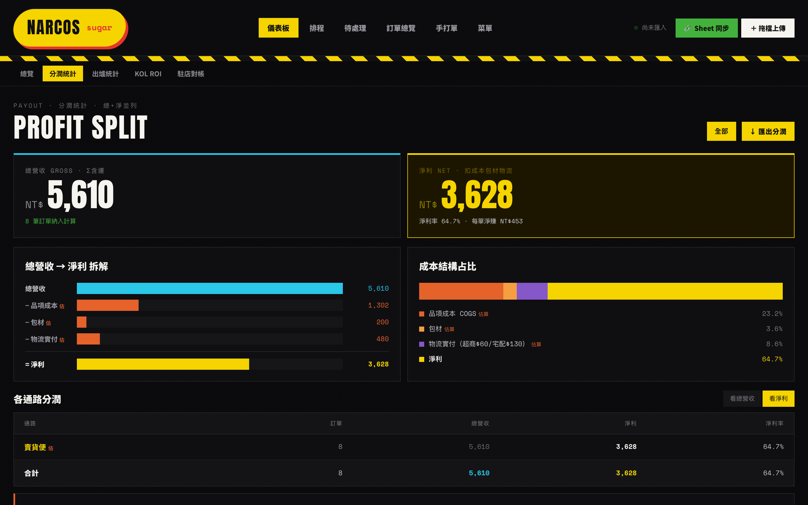

**出爐統計**：品項 × 批次的矩陣，讓老闆看到「這週要烤多少肉桂捲、多少蘋果肉桂捲、要準備幾罐堅果醬」：

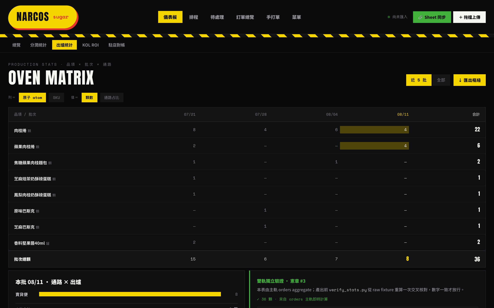

### 2. 排程系統 — 拖曳排出爐日、自動算工時

按週視圖排。左邊每一格是某批次（週二出貨），右邊是待排訂單。**拖過去就排入**，右上角顯示「工時預算」——超載會警告。

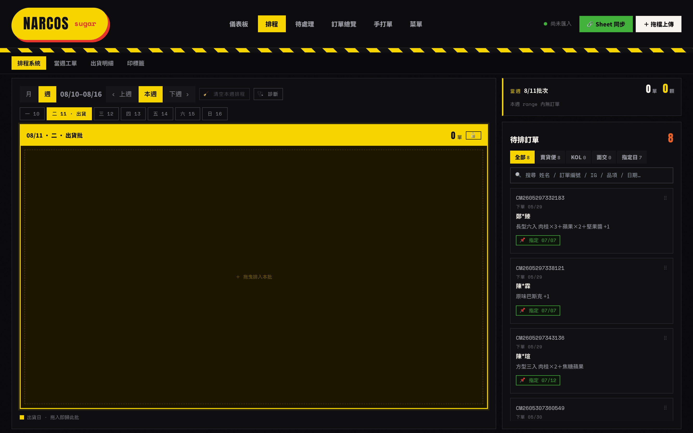

- 訂單卡上會標「📌 指定 MM/DD」（客戶指定日）、「💰 貨到付款」等等
- 支援 **鎖定批次**：排定後鎖住，防手殘拖錯
- 支援 **清空本週排程**（要二次確認）
- **雙向連動**：在排程頁點某批 → 切到「印標籤」/「當週工單」時就已經在那批，不用重找

**當週工單** — 給師傅看的簡化版，只有品項數量 + atom 展開：

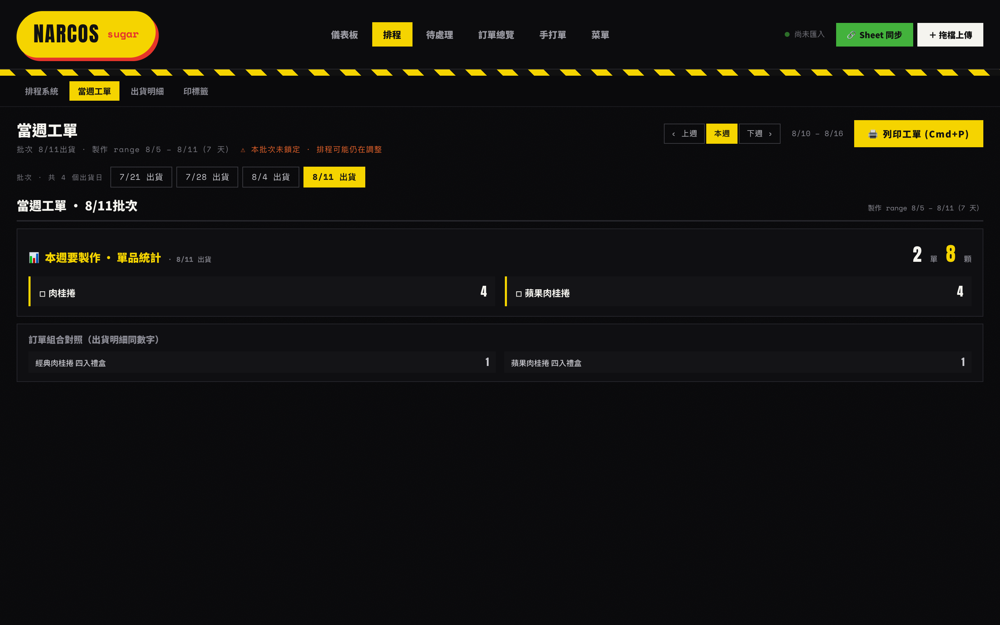

**出貨明細** — 每批一張、給老闆包裝時對照用：

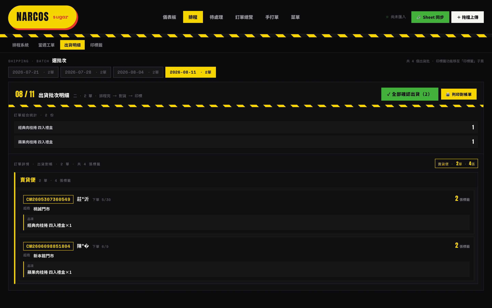

### 3. 印標籤 — 4×3cm 熱感應標籤、一鍵印全批

老闆的標籤機是 **Xprinter XP-P3301B**（4×3cm 熱感應）。點「印標籤」→ 選批次 → 右邊整批堆疊預覽（滾輪捲動看完）→ 一鍵印。

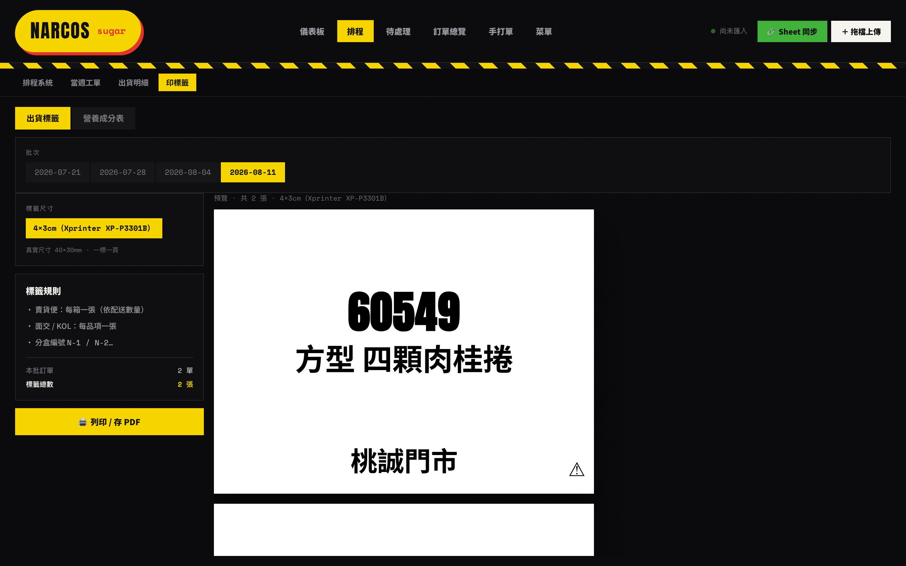

標籤三行契約（有嚴格字型/字重下限、保證熱感應機能印清楚）：

| 通路 | 第一行 | 第二行 | 第三行 |
|---|---|---|---|
| 賣貨便 | 訂單後五碼 | 分盒編號＋品項簡稱 | 門市 |
| 面交 | 中壢面交／台中面交／面交 | 分盒編號＋品項簡稱 | IG |
| KOL | KOL | @IG | 分盒編號＋品項簡稱 |

**營養成分表**（第二個子分頁）：同一台標籤機、5×8cm 尺寸，依批次自動算「這批要印哪幾張成分表、各幾張」：

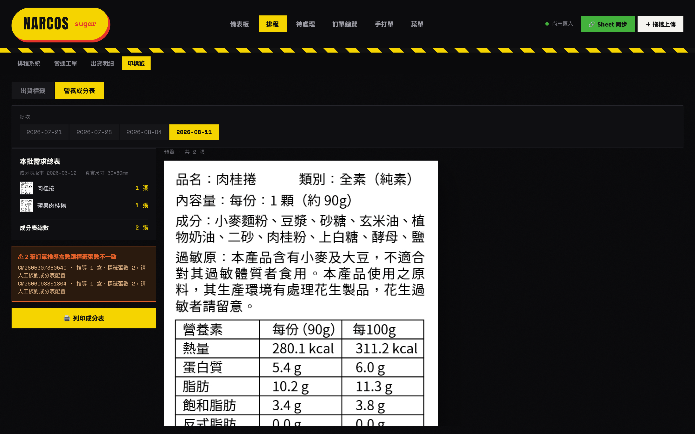

盒模型：組合品照 `menu.yaml` 的 `contains` 展開（例如「六入禮盒」自動 = 6 張），客製組合按老闆手動的分盒。

### 4. 待處理桶 — 主軌唯一的合法出口

**憲章 #1「靜默失效 = 0」的實體體現**：訂單只要有任何一點不確定（分類不到、金額對不上、日期衝突、指定日超出合理範圍…）就會落到待處理桶，主軌絕不放行。

桶清空 = 系統告訴你「可以出爐 / 可以出 Excel / 可以印標籤」：

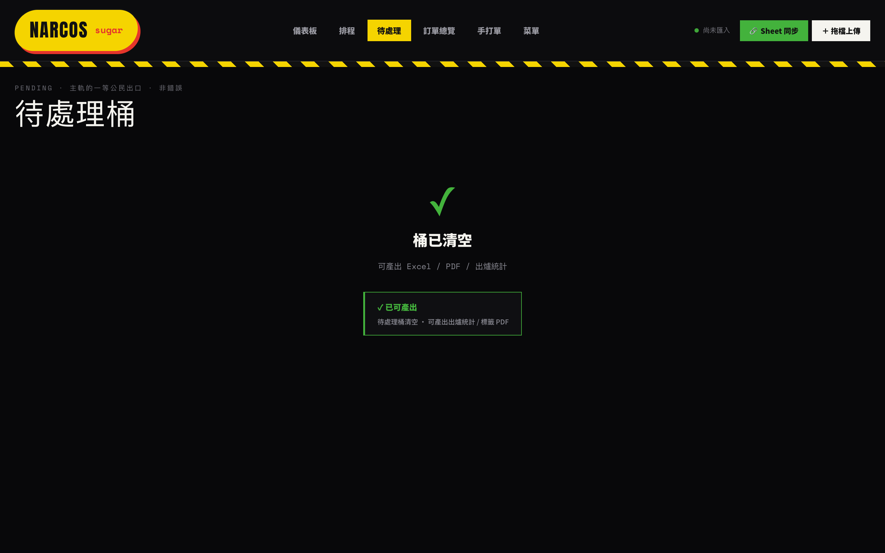

桶不空的時候會列出每筆的原因（reason code）跟建議動作。共 12 種 reason，最常見：
- `MISSING_BATCH_DATE`：解析不到出貨日 → UI 給快速選日期
- `CONFLICT_DATE_C12_C28`：xlsx 商品名寫的指定日跟網頁存檔（.htm）不同 → 兩個候選日給老闆選
- `PAYMENT_NOT_CONFIRMED`：付款未完成（但貨到付款會自動放行）
- `AMOUNT_MISMATCH`、`UNKNOWN_PRODUCT`、`DISAPPEARED`… 等等

### 5. 訂單總覽 — 全通路台帳

把三源匯進來的訂單放在同一張台帳。可篩通路（賣貨便/面交/KOL/宅配/手打單）、篩狀態、篩批次日期，搜尋姓名/訂單編號/品項/IG。

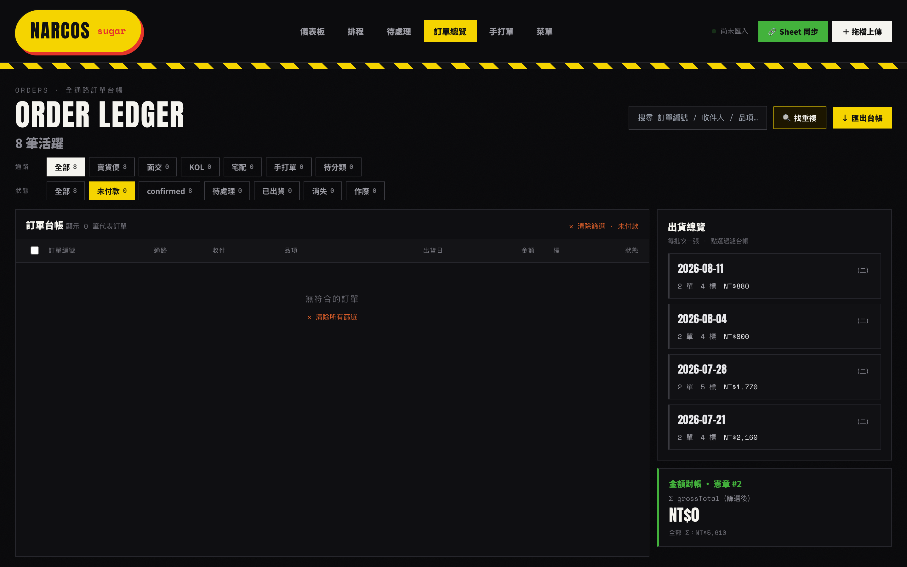

- 每一行右邊有 **🔒 狀態鎖**：預設鎖住防手殘，點一下解鎖才能改狀態
- 上方可 **勾選多筆批次改狀態**（例如：面交批次一次全部改成「已出貨」）
- **找重複** button：偵測疑似同一單被匯兩次（同名 + 同金額 + 相近日期）
- 支援 **單筆欄位編輯**（出貨批次/收件人/數量/金額）、變更會留在 `order_changes` 表
- 右下角有 **金額對帳**（憲章 #2）：篩選後金額必須跟總金額對得上

### 6. 手打單 — 老闆親手輸入的訂單（KOL/面交/宅配/客製）

兩個分頁：**消費者手打 / 駐店訂單**。消費者手打表單自帶通路/收件人/日期/品項/金額欄位：

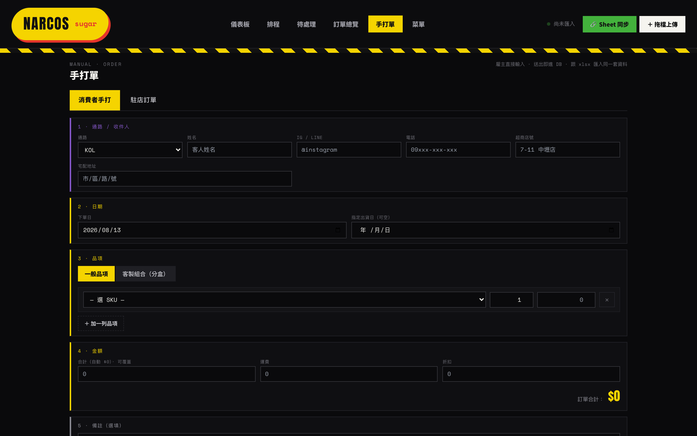

**品項區可切換「一般品項 / 客製組合（分盒）」**：

一般品項就從菜單挑 SKU + 數量；客製組合則按盒編排：

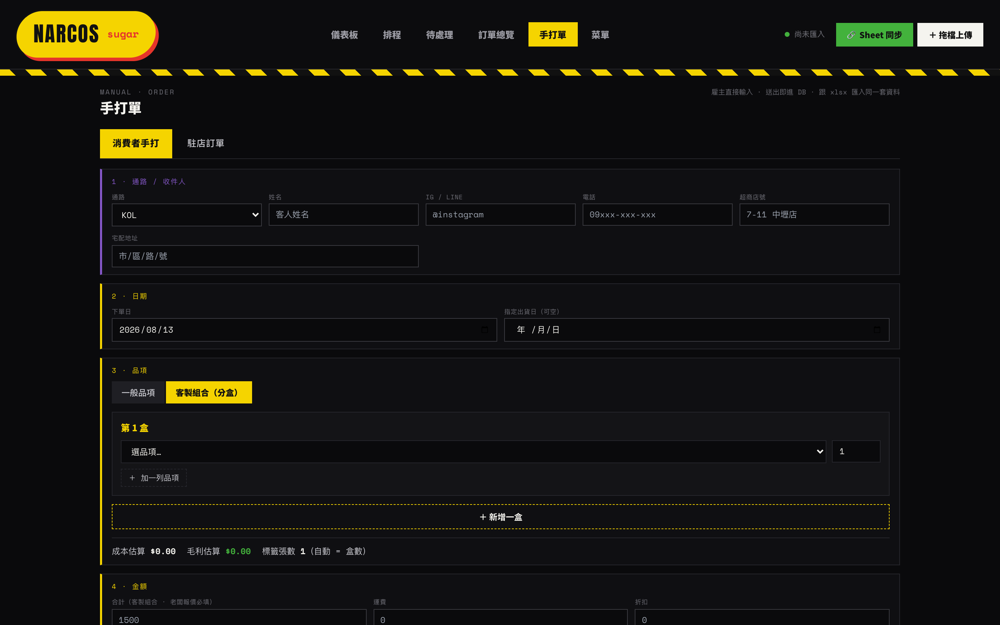

- 一盒一張標籤（自動算，不用手填標籤張數）
- 成本估算即時預覽（跟正式分潤同一套算法）
- 總價老闆自訂（客製報價）

**駐店訂單** — 合作店家批發專用，多了「店家選擇」「運費（老闆自付）」「結清狀態」欄：

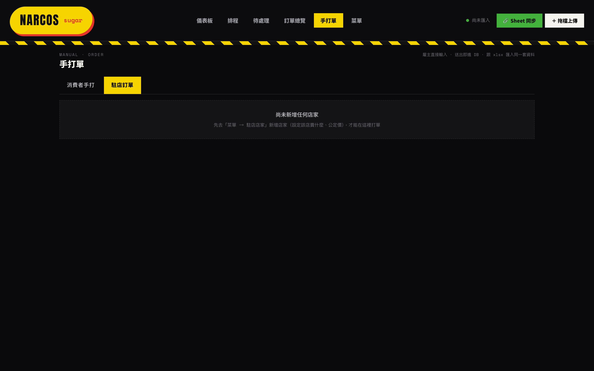

- 駐店運費會被分潤頁抓走、獨立列一項「駐店運費（老闆自付）」
- 結清 / 未結清狀態驅動「駐店對帳」頁的月結

### 7. 菜單 — 唯一的商品定義來源

`menu.yaml` 是全站唯一的 source of truth（品項名稱、單價、成本、組合展開、營養成分表檔名…）。菜單頁把 yaml 內容視覺化，可直接在 UI 編輯：

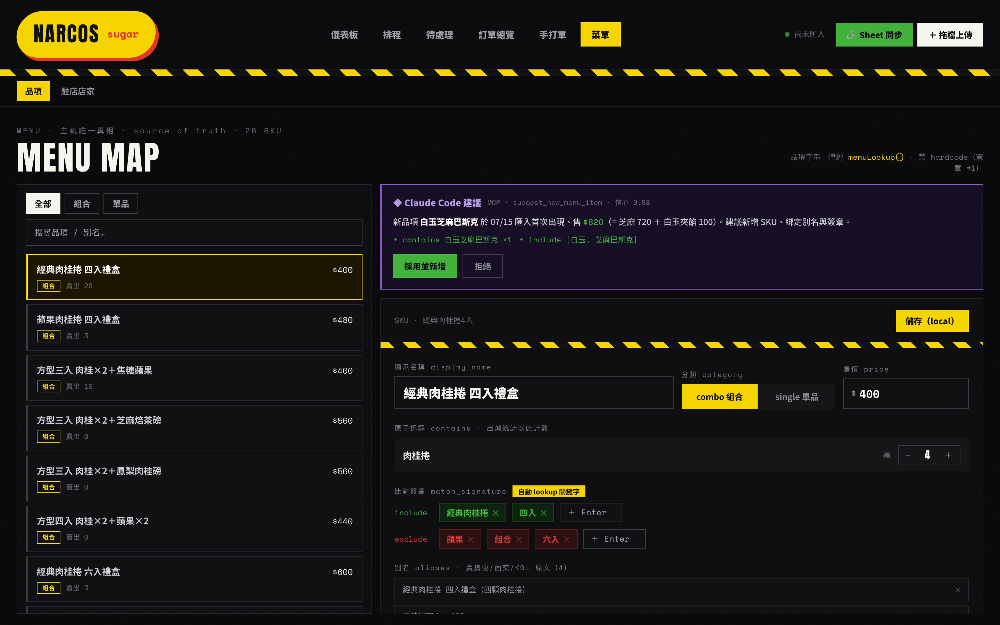

改動立即反映在所有頁面（成本 / 標籤 / 排程算量 / 營養成分表）。菜單有內建 lint（`menu-lint.ts`），啟動時會先掃描 alias 衝突 / signature 衝突 / 「N 入」數字對不上 contains 數，防止靜默 SKU 誤配對。

---

## 檔案匯入流程

三個地方都是同一個入口——**右上角「＋ 拖檔上傳」**（或直接拖檔到視窗）。系統自動判斷檔案類型：

| 檔案 | 用途 |
|---|---|
| `賣貨便 xlsx` | 主軌訂單資料 |
| `賣貨便 .htm / .html` | 網頁存檔補「指定出貨日」（xlsx 有時整批漏帶） |
| `面交 Google Form xlsx` | 面交訂單 |
| `KOL 合作 xlsx` | KOL 訂單 |

**同一批可以一次選多個檔一起拖進去**，系統會先寫 xlsx 訂單、再用 html 補指定日；不需要分次拖。重複匯入會自動 diff：新增/欄位變更/消失分別呈現，不會覆蓋人工留痕。

另外支援 **Google Sheet 同步**（面交問卷）——右上角綠色按鈕，OAuth 後直接拉最新回覆。

---

## 兩條專案憲章

這兩條決定了整個系統的技術取捨：

1. **LLM 不適合的地方一定用程式/函式庫等結構性設計，讓「靜默失效機率 = 0%」**
   - 所有帳算、對帳、產表都是 deterministic code
   - 任何不確定的資料一律進待處理桶、loud 呈現，主軌絕不放行
   - 十四條守恆律（訂單消失 / 資訊變動 / 匯入 diff…）全部落地，散落在 `tests/` 裡

2. **建立 AI native 流程或工具，把 LLM 放在最適當的位置**
   - Web app 本身**零 LLM 依賴**
   - 老闆自己的 Claude Code 透過 MCP server 讀 domain 資料（`query_orders`、`classify_pending`、`add_menu_item`…共 11 個 tool）
   - LLM 只在「對話介面 + 半結構化判斷」場景，帳一律程式算

詳見 [`docs/constitution.md`](docs/constitution.md)。

---

## 技術棧

- **前端**：Vite + React 18 + TypeScript + Tailwind
- **資料層**：Dexie.js（IndexedDB，所有訂單資料存瀏覽器本地）
- **檔案處理**：SheetJS（Excel 讀寫）
- **列印**：原生 `window.print()` + `@page` size + React Portal
- **MCP server**：`@modelcontextprotocol/sdk`（給 Claude Code 呼叫）
- **測試**：`node --test` + 真實 fixture（147 條測試涵蓋 parser / diff / 分潤 / 標籤 / 排程守恆律）
- **部署**：Vercel（GitHub push 自動部署）

## 架構

```
Human ──► Web UI ──► Domain Logic ──► IndexedDB
                          ▲
                          │
Claude Code ──► MCP Server（雇主自己訂閱）
```

- 資料只存瀏覽器本地 IndexedDB，隱私不外流
- 每週用「備份全部」下載 .json 存 Google Drive，換電腦用「還原備份」讀回來

## 目錄

```
narcos-oven/
├── data/menu.yaml           # 品項對照表（唯一 source of truth）
├── docs/                    # 憲章、專案筆記、截圖
├── src/
│   ├── domain/              # 純函式：diff、分潤、排程、標籤資料
│   ├── parsers/             # 賣貨便 / 面交 / KOL / html 各自的 parser
│   ├── ui/pages/            # 六個主分頁 + 各子分頁
│   ├── db/                  # Dexie schema、備份/還原
│   ├── output/              # Excel / PDF / 標籤資料展開
│   └── mcp/                 # MCP server（Claude Code 用）
├── tests/                   # 147 條 node --test（真實 fixture）
└── fixtures/                # 歷史原始資料（不進 git）
```

## 開始使用

```bash
pnpm install
pnpm dev              # web app（預設 http://localhost:3010）
pnpm test             # 跑全部測試
pnpm build            # 產 production build
pnpm mcp:dev          # 開 MCP server（讓 Claude Code 連）
```

---

_出爐指揮台，服務 NARCOS.sugar。_
